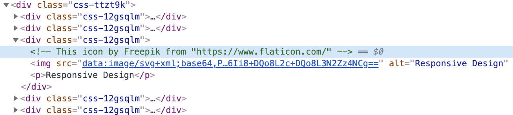

The responsive design icon I'm using in my "Skills & Tools" section has the above HTML comment to cite where I got it from.

Since my website is written in Gatsby, I initially looked for how to generate an HTML comment with Gatsby. I found [this](https://www.gatsbyjs.com/plugins/gatsby-plugin-html-comments/) plugin, but didn't feel satisfied with it.

I dug deeper and looked for how to generate an HTML comment with React, which lead me to [this](https://gist.github.com/alexeychikk/bfe72a072a9a962f2da900b6151e4aae) solution. The only problem was that I was looking for how to do this with functional components and not class components.

However, thanks to the class component solution I was able to create a functional component solution using refs.

In my [index.js](https://github.com/enrique-cardenas/personal-website/blob/master/src/pages/index.js) component I used the useRef hook to create a ref which I then attached to the SkillIcon component, which will take the responsive design icon. I also used the useEffect hook along with the [Element api](https://developer.mozilla.org/en-US/docs/Web/API/Element/innerHTML) to attach the HTML comment. 

```jsx
// Parent index component
export default () => {
  const commentRef = useRef();
  useEffect( () => {
    commentRef.current.innerHTML = `<!-- This icon by Freepik from "https://www.flaticon.com/" --> ${commentRef.current.innerHTML}`;
  }, [] );

  return (
    ...
      <SkillIcon src={ResponsiveDesign} 
        alt="Responsive Design" 
        name="Responsive Design" 
        ref={commentRef}
      />
    ...
  )
}
```

In order to forward the index component's ref to the SkillIcon component I used React.forwardRef. With the ref forwarded, I then attached it to the div containing the responsive design icon which ended up attaching the HTML comment.


```jsx
// SkillIcon component
export default React.forwardRef((props, ref) => {
  ...
  if(ref){
    return (
      <div css={IconContainer} ref={ref}>
        
        <p>{props.name}</p>
      </div>
    )
  }
  ...
}
```

Feel free to check out the full code for the [index component](https://github.com/enrique-cardenas/personal-website/blob/master/src/pages/index.js), the [SkillIcon component](https://github.com/enrique-cardenas/personal-website/blob/master/src/components/SkillIcon.js), and the full [repo](https://github.com/enrique-cardenas/personal-website).


