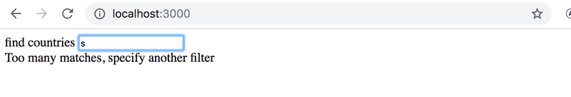
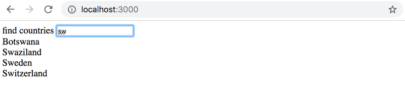
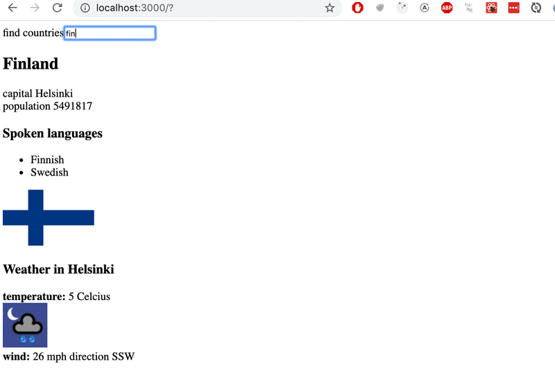

This page contains some of the exercises I have completed for this course.
I've done all of the exercises, but the ones I am showing cover the most important
concepts of the course.

This course takes a [Deep Dive into Modern Web Development](https://fullstackopen.com/en/).
The main focus is on building single page applications with ReactJS that use REST APIs built with Node.js and
interacts with a MongoDB database.

This course also covers Redux, React Router, custom hooks, and GraphQL.

One of my favorite things about this course is that it primarily uses React hooks from the start. I also enjoyed 
how it covered Javascript ES6 syntax, callbacks, promises, and async/await.

## Country Data

This application uses just React to display country data. Country data is fetched from the API https://restcountries.eu.
When a single country is viewed, the weather report for the capital is shown. The API to fetch the weather report is retrieved from
https://openweathermap.org/

https://github.com/enrique-cardenas/country-data

## Blog List

This blog list application allows users to save information about interesting blogs they have stumbled across on the internet.

<quad-image-wrapper 
    src1="fullstackopen/blog-list/login-page.png" alt1="login page image"
    src2="fullstackopen/blog-list/blog-list-page.png" alt2="blog list page image"
    src3="fullstackopen/blog-list/blog-example-page.png" alt3="blog example image"
    src4="fullstackopen/blog-list/users-page.png" alt4="users page image"
    >
</quad-image-wrapper>
> Built with React, Redux, Node.js, Express, and MongoDB

https://github.com/enrique-cardenas/blog-list-frontend
https://github.com/enrique-cardenas/blog-list-backend

[live demo hosted on heroku](https://arcane-tundra-01783.herokuapp.com/)

## Mini Library

This mini library application allows users to log in, post a book, view books posted, view authors, filter books by genre,
and view recommended books based on your favorite genre.

<quad-image-wrapper 
    src1="fullstackopen/mini-library/login-page.png" alt1="login page image"
    src2="fullstackopen/mini-library/authors-page.png" alt2="blog list page image"
    src3="fullstackopen/mini-library/books-page.png" alt3="blog example image"
    src4="fullstackopen/mini-library/add-book-page.png" alt4="users page image"
    >
</quad-image-wrapper>
<image-wrapper src="fullstackopen/mini-library/recommended-books-page.png" alt="recommended books page image">
</image-wrapper>

> Built with React, Apollo GraphQL client/server, and MongoDB

https://github.com/enrique-cardenas/graphql-mini-library
