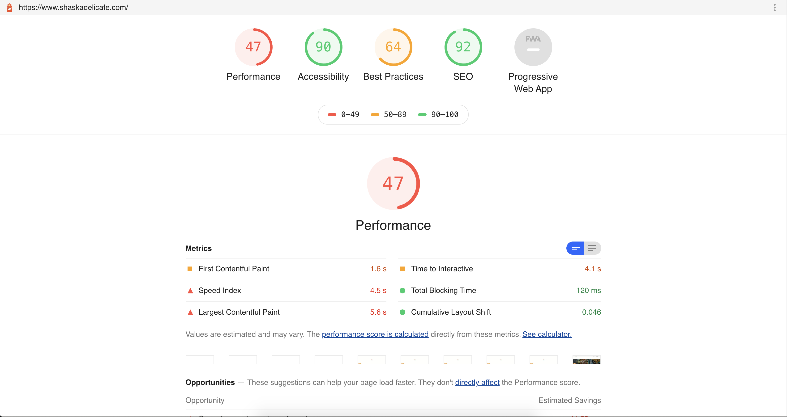
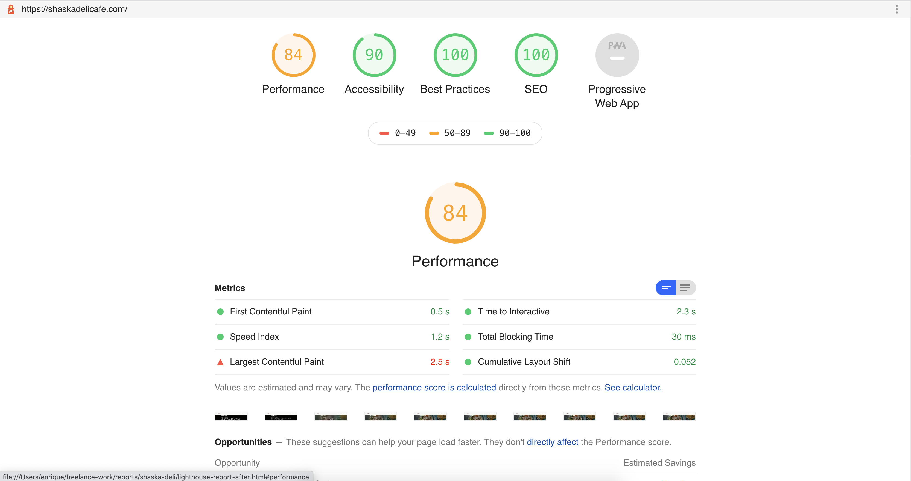

Rewrote entire website from Wordpress to React/Gatsby to significantly improve load times. 

Added Netlify CMS so client can change menu items and price, previously the client was not able to do this without asking previous developer. 

Moved hosting to Netlify to provide client with free hosting.

**Technology :** React, Gatsby, and NetlifyCMS.

**Website :** https://shaskadelicafe.com/

&nbsp;
## Lighthouse Report

> Before

> After

